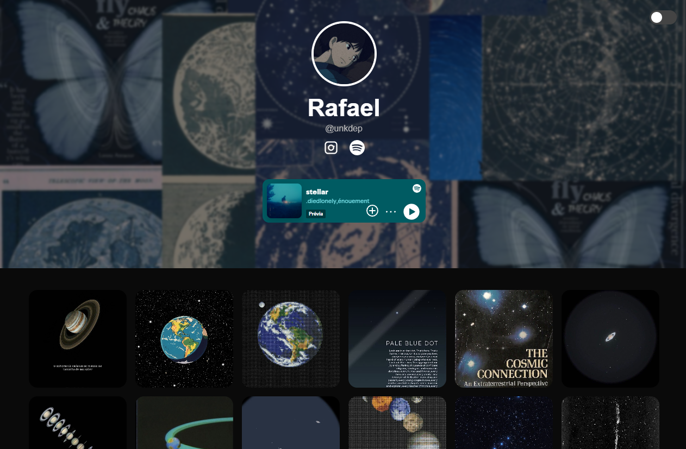

📁 Clone VSCO - Projeto Inspirado 📁

Este projeto é uma página inspirada no estilo visual e minimalista da rede social VSCO. Foi criado como um experimento de front-end usando HTML e CSS puro, com foco em design, estética e responsividade.

💡 Objetivo 💡

A proposta é reproduzir a estética visual do VSCO com liberdade criativa, explorando:

•Um layout minimalista e elegante
•Tipografia limpa
•Galeria de imagens responsiva
•Boa usabilidade visual

📸 Demonstração 📸
Acesse o projeto publicado no Netlify:
👉 https://clonevsco.netlify.app/

🛠️ Tecnologias Utilizadas 🛠️

•HTML5
•CSS
•JavaScript
•Flexbox e Grid Layout
•Media Queries para responsividade

📁 Estrutura de Arquivos 📁

profile/
├── index.html
├── style.css
└── README.md

🚀 Como Rodar Localmente 🚀

1. Clone este repositório:

git clone https://github.com/seu-usuario/clone-vsco.git

2. Acesse a pasta:

cd clone-vsco

3. Abra o arquivo index.html em qualquer navegador moderno.

🚧 Status do Projeto 🚧

✔️ Finalizado — mas aberto para melhorias visuais ou responsivas no futuro.

